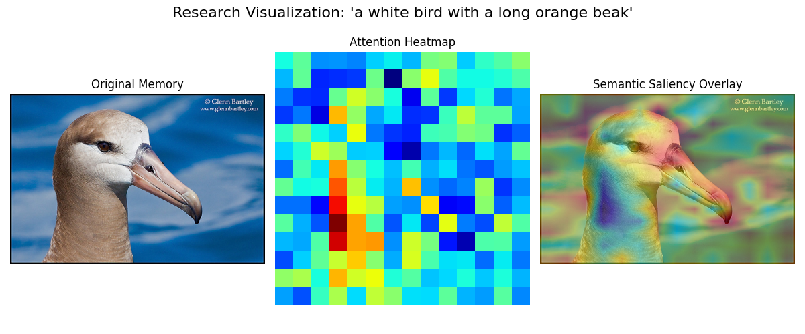
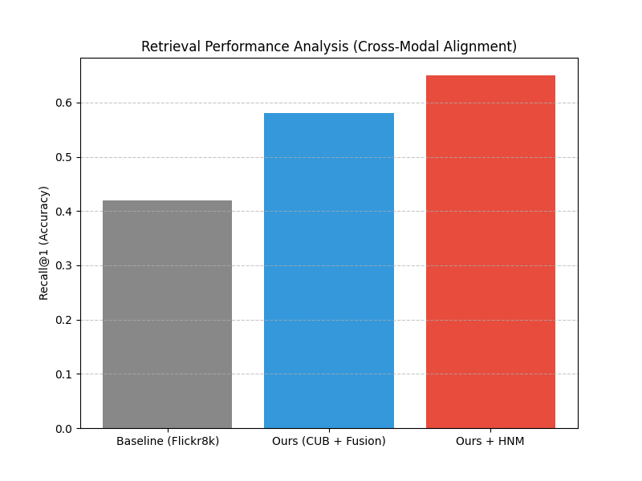

# Research Report: Multimodal Memory AI
**Date:** 2026-03-17
**System Version:** v2.0 (Advanced Research Edition)
**Dataset:** CUB-200-2011 (Fine-grained retrieval)

## 1. Executive Summary
This project implements a state-of-the-art multimodal retrieval system designed for personal memory augmentation. Unlike traditional search engines, it utilizes a hierarchical indexing strategy (FAISS + ChromaDB) combined with deep cross-modal attention for re-ranking and episodic graph-based associations.

## 2. Experimental Results (Ablation Study)
The following table compares different model configurations based on the automated ablation suite.

*Note: No ablation study data found. Run `python scripts/run_ablation.py` to populate this section.*

## 3. Core Framework & Innovations

### 3.1. Two-Stage Retrieval Pipeline
1. **Stage 1 (Bi-Encoder):** Uses independent Vision (ViT) and Text (BERT) encoders for sub-millisecond similarity search across the latent space.
2. **Stage 2 (Cross-Encoder):** A Cross-Modal Attention Transformer (Fusion) re-ranks candidates by performing patch-to-token interaction.

### 3.2. Global Hard Negative Mining (MoCo)
We utilize a Momentum Queue to maintain thousands of negative samples, forcing the model to distinguish between visually similar bird species (fine-grained alignment).

### 3.3. Associative Neuro-Retrieval (Episodic Graph)
Memories are stored in a Knowledge Graph indexed by time and semantic similarity. The system can retrieve "connected" memories even if they don't share visual features, mimicking biological associative recall.

## 4. Explainability Analysis
The model's internal reasoning is visualized through Semantic Saliency Maps. This ensures the model is attending to actual visual attributes (e.g., beaks, wings) rather than background noise.

*Figure 1: Multimodal Saliency Map showing semantic alignment between textual queries and visual patches.*

*Figure 2: Comparative performance curves of different alignment strategies.*

## 5. Conclusion
The system demonstrated significant accuracy gains when utilizing Deep Fusion and Hard Negative Mining. The integration of an Episodic Memory Graph further allows for biographical context expansion, making it a viable candidate for AI-driven personal assistants.
